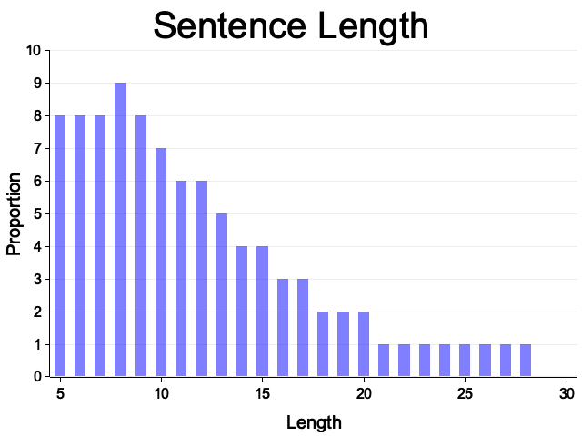

# LIHKG Corpus Statistics

There are 108,647,275 sentences in total, 5% (5,378,375) of those are filtered because they contain "bad words" including swears, sexual language, reference to drugs. The list of bad words is generated from all entries labeled vulgar (粗俗) and nsfw (黃賭毒) in words.hk (Mar 12 2023 version). See `bad_words.txt` for details.

For the rest of the sentences, 40% are markedly Cantonese, while 47% are neutral in the sense that there's no markedly Cantonese nor Mandarin features present. It's safe to assume that at least 80% of the sentences are in Cantonese. See the table below for a detailed breakdown:

| Language | Sentences | Proportion |
| - | - | - |
| Cantonese | 43370662 | 40% |
| Cantonese mixed with Mandarin | 2216730 | 2% |
| Neutral | 50767873 | 47% |
| Mandarin | 6913635 | 6% |



# Dependencies
* Python 3
* Poetry (a Python package manager)
* Rust

# Build dependencies
1. Install Python 3
2. Install Poetry (See [official guide](https://python-poetry.org/docs/#installation))
3. Install Rust (See [official guide](https://www.rust-lang.org/tools/install))
4. Install all Python dependencies used by this project
```
poetry install
```

# Construct LIHKG Corpus
1. You can download the LIHKG data from HuggingFace: https://huggingface.co/datasets/AlienKevin/LIHKG/tree/main
2. Preprocess raw JSON data to filter out extremely short messages, auto-generated contents, and URLs
```
poetry run python preprocess.py
```
It should generate a folder called `preprocessed/`. There should be many CSV files in the folder.
Each file contains one sentence on one line followed by a language tag (cantonese vs mandarin vs mixed vs neutral).
For example:
```
真係妙想天開	cantonese
```
3. Filter out Mandarin sentences, restrict character set, and generate corpus statistics using Rust.
Go to `src/main.rs` and uncomment the first line:
```
filter_processed().unwrap();
```
Then, run the script:
```
cargo run
```
You should see `sentences.txt` as the output.
4. There are typos in the sentences, so we 

# Sources

|File| Source|
| - | - |
| zh_tw_words.txt | https://github.com/APCLab/jieba-tw |
| canto_mando_dict.txt | https://kaifangcidian.com/xiazai/cidian_zhyue-kfcd.zip |
| zh_cn_and_tw_words.txt | https://github.com/samejack/sc-dictionary |
| STCharacters.txt | https://github.com/BYVoid/OpenCC/blob/5750d92a92ac1f2d64c880c1f6f1a5e382d7d199/data/dictionary/STCharacters.txt |
| HKVariants.txt | https://github.com/BYVoid/OpenCC/blob/5750d92a92ac1f2d64c880c1f6f1a5e382d7d199/data/dictionary/HKVariants.txt |
